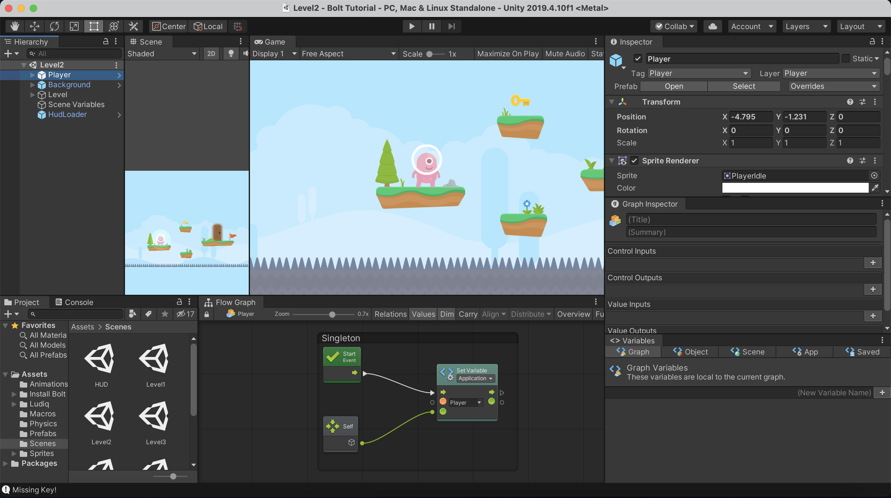

# Hack Technology / Project Attempted

## What you built? 

We attempted the Unity/Bolt tutorial found [here](https://learn.unity.com/project/bolt-platformer-tutorial). We built a game in Unity with the following elements:

**Levels**

**Keys and doors**

**Enemies that follow the character around**

**Projectiles**

## Who Did What?

The online tutorial itself is well divided into parts, therefore, we each chose parts we were interested in solving:
1. *Maria*: Set up the Unity folder, downloaded the assests and prefabs, added the character movements from left to right.
2. *Lizzie*: Added the animations when the character moved, like the small steps the character's feet take.
3. *Maria*: Added the jump animations and ground check. This made sure the character landed properly on the platforms. 
4. *Lizzie*: added level change when the character reaches the red flad and spike death behavior that resets the scene.
5. *Maria* added the HUD which is the scene atop the main scene the displays the hearts and keys. Then, I set up door and key behaviors.
6. *Lizzie*: added the health and damage behavior, which included enemy attacks and death on spikes. Moreover, had to set up the enemy AI and projective attack so that it attacked the character and made the game more intense. 
    * The enemies will patrol their platform randomly until the player comes nearby. When that happens, they will chase the player. If the player escapes, they will go back to random.
7. *Maria*: set up the pause and main menus so that the game navigation was all set up.

However, even though we each worked on a specific part, we both would look and pay attention while the other one worked. This way, we both managed to get the same learning experience out of the tutorial and get to work together whenever we got stuck. 

## What you learned

Before the tutorial even begun, Lizzie and I had to learn how to set up Unity and join the student program. Once we had downloaded it, we played around with the interface to figure out how to set up a new scene, download assets, and use prefabs. 

Throughout the tutorial, we managed to learn several different things. The first and main thing we learnt, was how to use the Bolt Visual Scripting interface and become familiar with these Visual Scripting concepts. Instead of coding up the behaviors of items, you work with flow graphs and nodes to set up the whole game. From this, we learnt how to navigate the Bolt Graph, Graph Inspector and Variables windows. 

Once thing that we really didn't enjoy, was working on such a small computer screeen. These graph interfaces each take up a lot of space, leaving the screen to be very crowded and cluttered. We would have enjoyed this tutorial more on a dual screen monitor or a larger computer screen. This clutter can be clearly seen in the image below.

Something complicated was that each node had several variables that were too small on our screen. This made it easy to mistakenly miss to fill one in and the whole behavior to fail. Causing us to have to go back and check each individual variable once again. 

Another thing we learnt was how to create a full 2D video game experience with 4 levels, a pause and main menu, enemies, and fun experiences. It was definitely a fun and engaging experience. 

## Authors

* Lizzie Hernandez
* Maria Mora Bolaños

## Acknowledgments

Based on Unity's tutorial of Bolt: https://learn.unity.com/project/bolt-platformer-tutorial
